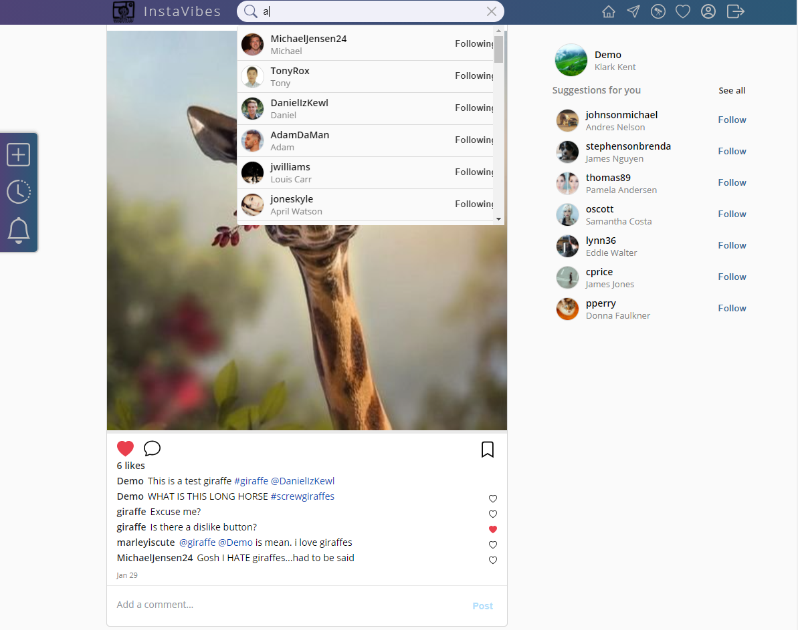
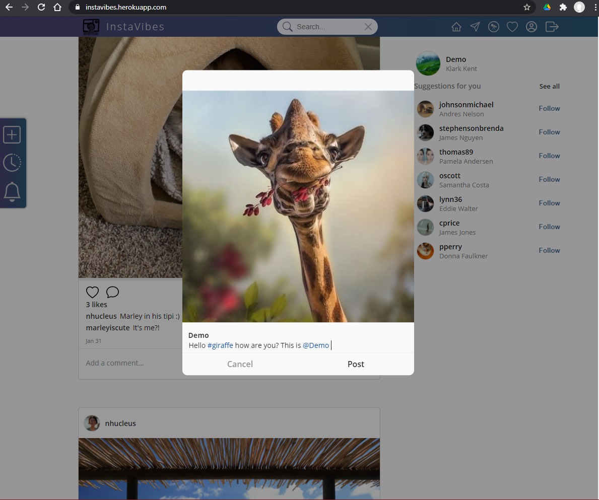
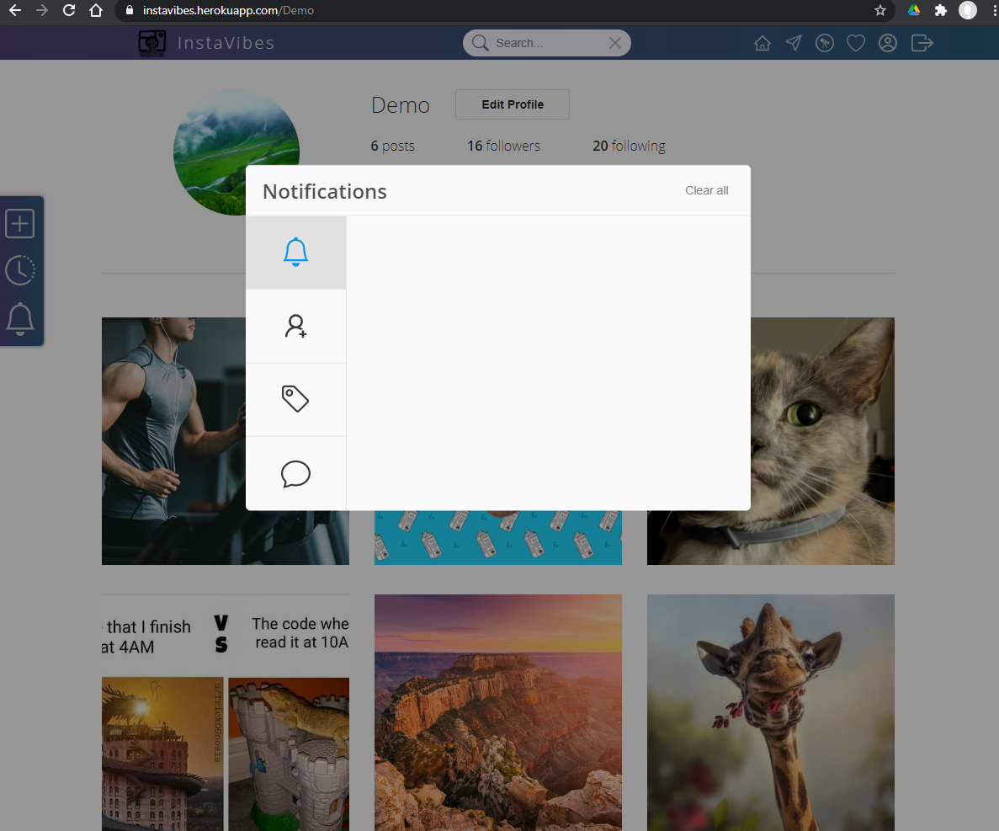
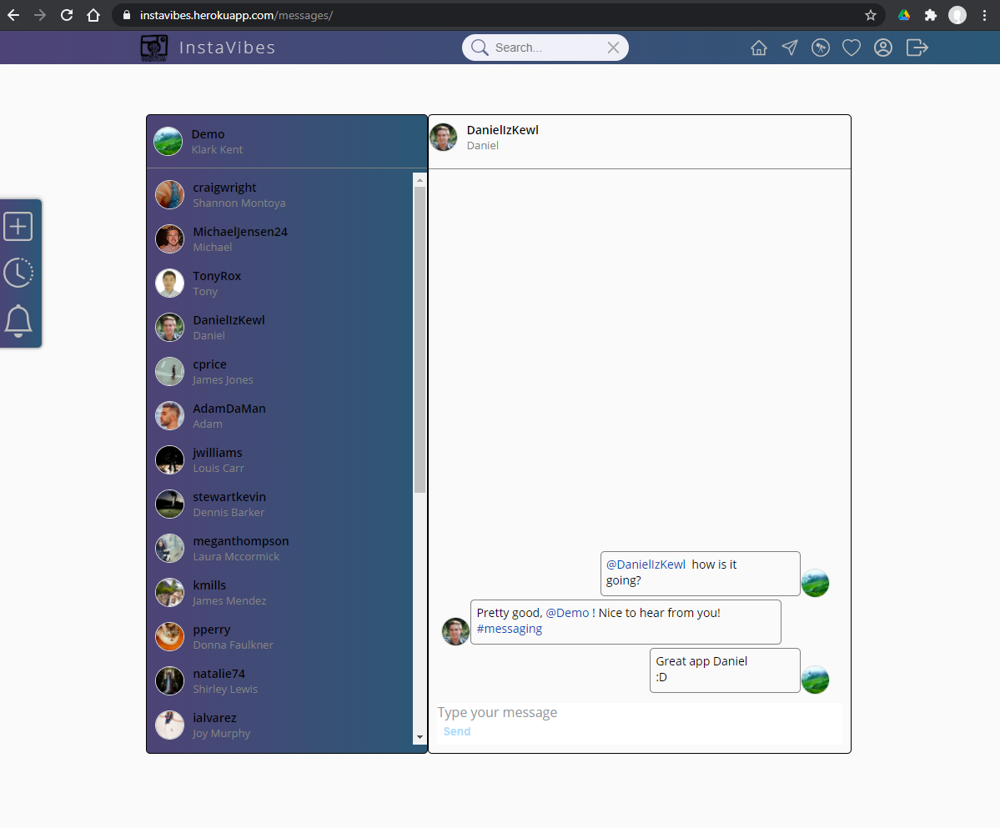
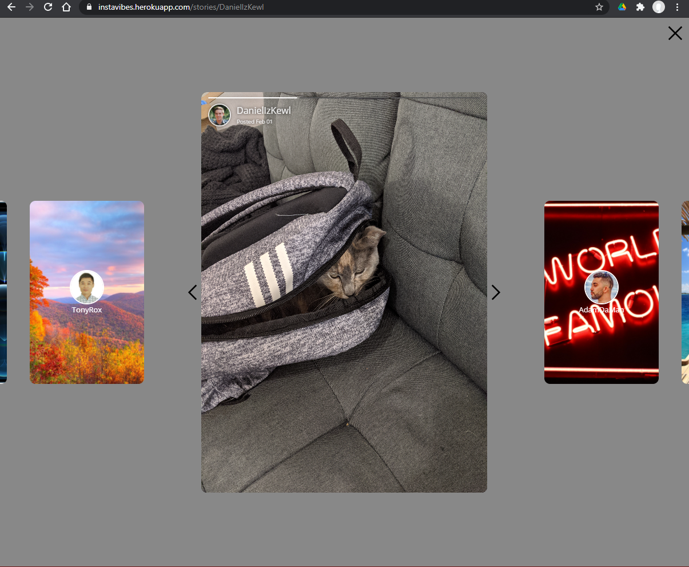

[![Forks][forks-shield]][forks-url]
[![Stargazers][stars-shield]][stars-url]
[![Issues][issues-shield]][issues-url]
[![MIT License][license-shield]][license-url]
[![LinkedIn][linkedin-shield]][linkedin-url]
<!--ReactSkipperStart -->
<br />
<p align="center"  style='margin-top: -40px; margin-bottom: -10px;'>
  <a href="https://github.com/suasllc/instavibes">
    
  </a>

  <p align="center">
    <b>Instavibes</b> is a social networking application modeled and inspired by <i>Instagram</i>
    <br />
    <br />
    <a href="https://github.com/suasllc/instavibes/wiki"><strong>Explore the docs »</strong></a>
    <br />
    <br />
    <a href="https://instavibes.herokuapp.com/">View Demo/Live</a>
    ·
    <a href="https://github.com/suasllc/instavibes/issues">Report Bug</a>
    ·
    <a href="https://github.com/suasllc/instavibes/issues">Request Feature</a>
  </p>
</p>


<details open='open'>
   <summary>Table of Contents</summary>
   <ol style='margin: 0px 30px 0px 0px'>
      <li>
         <a href="#about-the-project">About The Project</a>
         <ul>
            <li><a href="#what-is-the-project">What is the project</a></li>
            <li><a href="#technologies">Technologies</a></li>
         </ul>
      </li>
      <li>
         <a href="#getting-started">Getting Started</a>
         <ul>
         <li><a href="#prerequisites">Prerequisites</a></li>
         <li><a href="#installation">Installation</a></li>
         </ul>
      </li>
      <li><a href="#usage">Usage</a>
         <ul>
            <li><a href="#more-screenshots">More Screenshots</a></li>
         </ul>
      </li>
      <li><a href="#roadmap">Roadmap</a></li>
      <li><a href="#contributing">Contributing</a></li>
      <li><a href="#license">License</a></li>
      <li><a href="#acknowledgements">Acknowledgements</a></li>
   </ol>
</details>


## About The Project
### What is the project

 **Instavibes** is a social networking application modeled and inspired by _Instagram_. Instavibes incorporates much of the same image-sharing and social network features of instagram while improving much upon it's browser ease of use, and simultaneously expanding on pre-existing Instagram functionality. 

Image hosting for this application utilizes _Amazon Web Services S3 cloud storage_. The backend of Instavibes uses Flask/SQLAlchemy 
with PostgresSQL, allowing for database queries to run efficiently utilizing RESTful API routes. The frontend incorporates React.js with a Redux framework. This enables Instavibes to a have a state management library to optimize both logging changes to data, and persisting data throughout navigation.
<!--ReactSkipperEnd -->

<!--ReactSkipperStart -->
<details open="open">
   <summary>Screenshots: Homepage, New Post and Profile page</summary>
   <div style="display: flex">
      
      
      
   <div>
</details>


### Technologies
- List of Technologies used for this project

| A. Package  	| B. FrontEnd  	| C. Backend  	|
|---	|---	|---	|
| [npm](https://www.npmjs.com/)   	| [JavaScript](https://www.javascript.com/)  	|  [Python](https://www.python.org/) 	|
| [Docker](https://www.docker.com/)  	| [React](https://github.com/facebook/react)  	|  [Flask](https://flask.palletsprojects.com/en/1.1.x/) 	|
| [Heroku](https://heroku.com) 	| [Redux](https://github.com/reduxjs/redux) 	|  [SqlAlchemy](https://flask-sqlalchemy.palletsprojects.com/en/2.x/) 	|
| [Pipenv](https://pypi.org/project/pipenv/)	| [CSS3](https://www.w3.org/Style/CSS/) 	|  [PostgreSQL](https://www.postgresql.org/) 	|
| 	| [HTML5](https://en.wikipedia.org/wiki/HTML5)	|  [AWS S3](https://aws.amazon.com/) 	|
<!--ReactSkipperEnd -->

## Getting Started

To get a local copy up and running follow these steps.

### Prerequisites

Install npm on your local computer
* npm
  ```sh
  npm install npm@latest -g
  ```

### Installation
1. Clone this repository (only this branch)

   ```bash
   git clone https://github.com/suasllc/instavibes.git
   ```

2. Install dependencies

      ```bash
      pipenv install --dev -r dev-requirements.txt && pipenv install -r requirements.txt
      ```

3. [Further steps here](https://github.com/suasllc/instavibes/wiki/Installation-Details)

## Usage
<!--ReactSkipperStart -->
### More Screenshots

<details open="open">
   <summary>Message and Stories</summary>   
   <div style="display: flex">
      <!-- <div style='display: flex; flex-direction: column; width="40%"'> -->
         
         
      <!-- </div> -->
   <div>
</details>


<!--ReactSkipperEnd -->

_For more examples, please refer to the [Documentation](https://github.com/suasllc/instavibes/wiki)_


## Roadmap

See the [open issues](https://github.com/suasllc/instavibes/issues) for a list of proposed features (and known issues).


## Contributing

Contributions are what make the open source community such an amazing place to be learn, inspire, and create. Any contributions you make are **greatly appreciated**.

1. Fork the Project
2. Create your Feature Branch (`git checkout -b feature/AmazingFeature`)
3. Commit your Changes (`git commit -m 'Add some AmazingFeature'`)
4. Push to the Branch (`git push origin feature/AmazingFeature`)
5. Open a Pull Request


## License

Distributed under the MIT License. See `LICENSE` for more information.


## Acknowledgements

* [App Academy](https://www.appacademy.io/)
* [Unsplash](https://unsplash.com/)
* [Best-README-Template](https://github.com/othneildrew/Best-README-Template)


[contributors-shield]: https://img.shields.io/github/contributors/suasllc/instavibes.svg?style=for-the-badge
[contributors-url]: https://github.com/suasllc/instavibes/graphs/contributors
[forks-shield]: https://img.shields.io/github/forks/suasllc/instavibes.svg?style=for-the-badge
[forks-url]: https://github.com/suasllc/instavibes/network/members
[stars-shield]: https://img.shields.io/github/stars/suasllc/instavibes.svg?style=for-the-badge
[stars-url]: https://github.com/suasllc/instavibes/stargazers
[issues-shield]: https://img.shields.io/github/issues/suasllc/instavibes.svg?style=for-the-badge
[issues-url]: https://github.com/suasllc/instavibes/issues
[license-shield]: https://img.shields.io/github/license/suasllc/instavibes.svg?style=for-the-badge
[license-url]: https://github.com/suasllc/instavibes/blob/master/LICENSE.txt
[linkedin-shield]: https://img.shields.io/badge/-LinkedIn-black.svg?style=for-the-badge&logo=linkedin&colorB=555
[linkedin-url]: https://www.linkedin.com/in/tony-ngo-suas/
